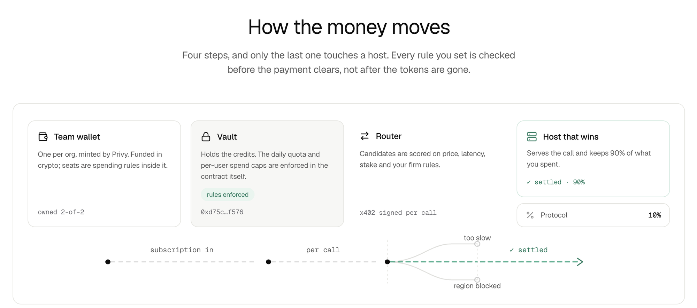

<div align="center">


# TrulyOpenRouter

**Actually OpenRouter on Crypto Rails powered by x402**

[](https://trulyopenrouter.vercel.app)
[](https://github.com/Lucas749/TrulyOpenRouter)

</div>

User pays a classic usage subscription and a decentralized network of hosts server inference. 
Every API request settles via x402. Hosts can monitize excess compute.

> **Become a host with one command**
>
> ```sh
> curl -fsSL https://trulyopenrouter.vercel.app/install.sh | bash
> ```
>
> Picks a model that fits your machine, puts an x402 paywall in front of it, stakes on
> Hedera, and starts earning per request.

## How it works

[](https://trulyopenrouter.vercel.app)

1. **Subscribe** — HBAR into `SubscriptionVault` → credits (10 HBAR → 10,000).
2. **Chat** — the gateway routes to a host; $0.001 testnet USDC goes to that host's
   wallet via x402 (Blocky402 facilitator); vault credits are metered down. One receipt
   ties both legs together.
3. **Stake** — hosts lock HBAR in `HostRegistry` to serve. Released via `release()` after
   deregister + timelock, gated by a Ledger tap.
4. **Teams** — a Privy team wallet buys credits through approved
   intents. Members and team agents spend within allowances; linked hosts collect into it.
5. **Agents** — `tor_sk_agt_` tightly scoped keys with hard limits. Over the limit the request stops and
   waits for a human instead of spending more with ledger support.

Live on Hedera testnet:
[**HostRegistry** `0x5f83c194…dc56`](https://hashscan.io/testnet/contract/0x5f83c19413fc15181e2e79512947e374c7b8dc56) ·
[**SubscriptionVault** `0xd75c46c0…f576`](https://hashscan.io/testnet/contract/0xd75c46c0e82115ab4d24326dbbbbffe4e7d0c576) ·
[**USDC** `0.0.429274`](https://hashscan.io/testnet/token/0.0.429274) ·
[**HCS audit topic** `0.0.10379640`](https://hashscan.io/testnet/topic/0.0.10379640)


## Operator configuration

| Var | What | Default |
|---|---|---|
| `SECRETS_BACKEND=ring` | Decrypt `gateway/secrets/*.enc` at boot (needs `WALLET_PASS`) | env vars |
| `TAP_HEDERA_ACCOUNT` | Recorded Ledger Hedera account tap approvals must come from | unset = taps 501 |
| `TAPS_DIR` / `MIRROR_URL` | Tap store dir / mirror node for approval checks | `./.data`, testnet mirror |
| `GATEWAY_ADMIN_TOKEN` | Authorizes `/api/admin/*` (web is the only caller) | unset = 501 |
| `PRIVY_APP_ID` / `PRIVY_APP_SECRET` | Server verification of browser sessions and linked wallets | missing = browser inference unavailable |
| `RPC_URL` / `VAULT_ADDRESS` / `OPERATOR_KEY` | Subscription balance reads and confirmed debits | missing = inference unavailable |
| `BUDGET_MASTER` | Derives a separate subscription payer for each API key | missing = keyed inference unavailable |
| `X402_PAYER_ID` / `X402_PAYER_KEY` | Separately funded test USDC payer for hosts | required for paid host requests |
| `HEDERA_SERVICE_ACCOUNT_ID` | Optional additional x402 charge at the gateway entrance | unset = subscription gate only |
| `HOSTS_JSON` | Static hosts, no chain (`[{endpoint,modelId,…}]`) | onchain registry |
| `GATEWAY_CREDIT_UNITS` | Units per credit (money rule: 1e5) | `100000` |
